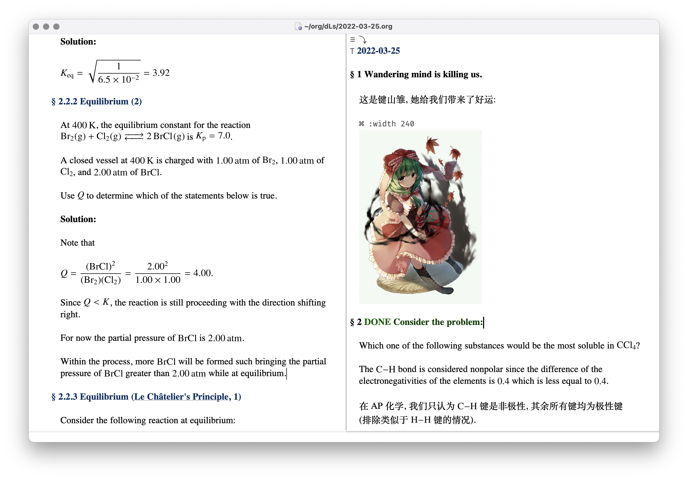
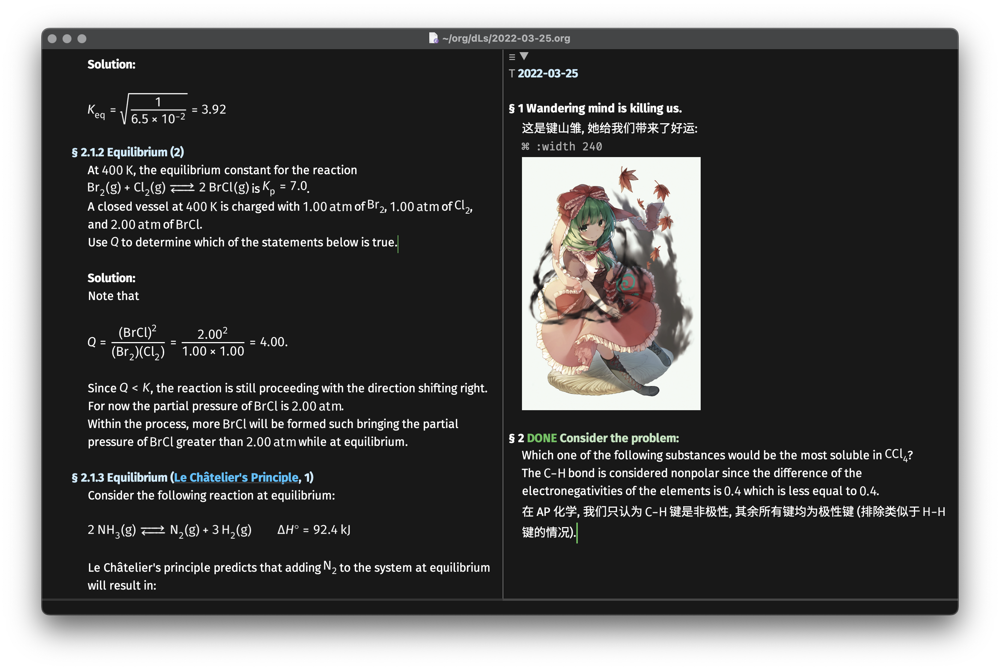

Funding for this program was made possible by viewers like you.

---

A simple setup for [emacs-mac](https://bitbucket.org/mituharu/emacs-mac/src/work/) focusing on scientific writing in Org mode.

古典学术 ♡ 现代设计
